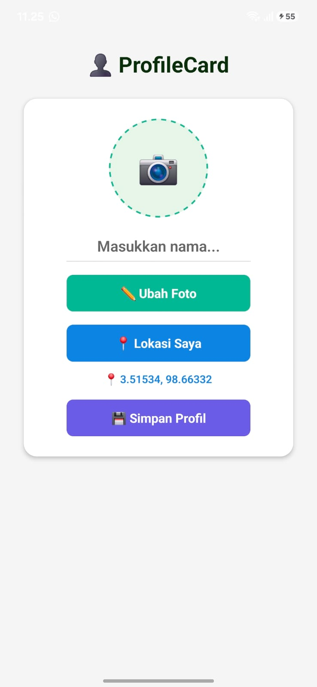
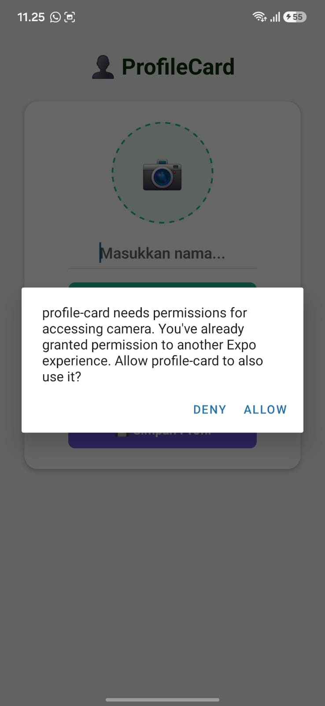
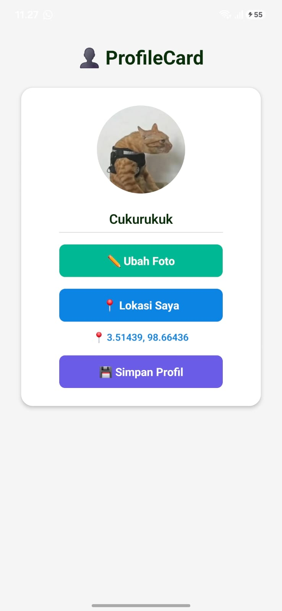

ProfileCard

Deskripsi Aplikasi

ProfileCard adalah aplikasi mobile sederhana berbasis React Native (Expo) yang memungkinkan pengguna membuat kartu profil pribadi. Pengguna dapat mengubah foto profil menggunakan kamera atau galeri, memasukkan nama, melihat lokasi GPS saat ini, serta menyimpan data profil agar tetap tersedia ketika aplikasi dibuka kembali.

Aplikasi ini dibuat sebagai implementasi penggunaan native device features pada React Native dengan Expo.

📱 Fitur Aplikasi
Level 1
✅ Menampilkan kartu profil.
✅ Input nama pengguna.
✅ Menampilkan foto profil.
✅ Menggunakan Permission Flow sebelum mengakses fitur perangkat.
Level 2
✅ Mengambil foto menggunakan Kamera.
✅ Memilih foto dari Galeri.
✅ Mengambil lokasi GPS pengguna.
✅ Menyimpan data profil menggunakan AsyncStorage.
🔐 Native Features yang Digunakan
📷 Kamera (expo-image-picker)
🖼️ Galeri (expo-image-picker)
📍 GPS / Lokasi (expo-location)
💾 Penyimpanan Lokal (@react-native-async-storage/async-storage)
📷 Screenshot
1. Halaman Utama / Profile Card

2. Dialog Permission Kamera atau Lokasi

3. Hasil Foto Profil / Koordinat Lokasi

Expo Snack:

[https://snack.expo.dev/@fatur07-02/profile-card]
